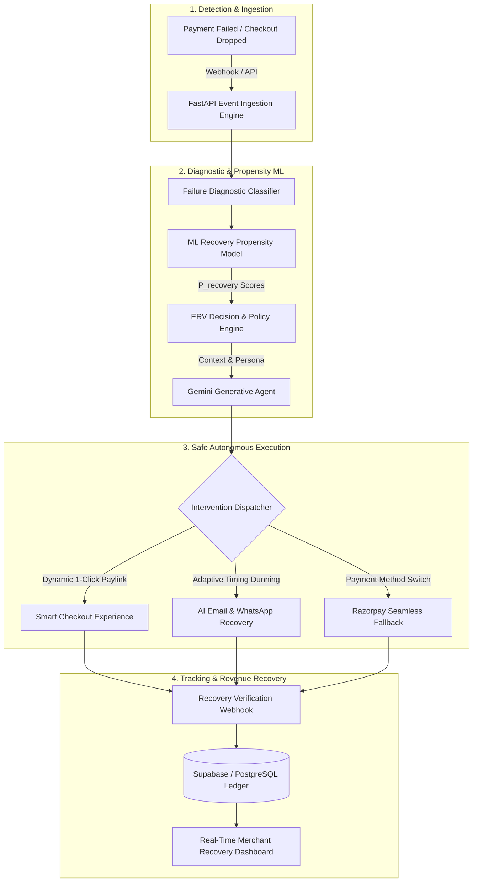

# RecoverAI — Autonomous AI Revenue Recovery Agent for Digital Payments

> **RecoverAI** is an autonomous revenue recovery engine that detects failed digital payments and abandoned checkouts in real-time, diagnoses failure root causes, scores recovery propensity with Machine Learning, optimizes Expected Recovery Value (ERV) across multi-channel interventions, and safely executes autonomous recovery workflows.

---

## ⚡ The Problem

In digital commerce and SaaS, **failed payments and abandoned checkouts account for 15% to 30% of lost revenue**:
- **Payment Decline Friction**: Network timeouts, insufficient funds, authentication (3DS/OTP) failures, and card expiry cause immediate drop-offs.
- **Dumb Dunning Strategies**: Traditional platforms rely on static email blast sequences or fixed retry clocks that annoy customers and have dismal 10-15% recovery rates.
- **Zero Real-Time Context**: Generic retries do not account for user intent, payment method reliability, error codes, historical customer LTV, or optimal retry timing.
- **High Churn & Inaction**: Incomplete checkouts remain dormant without dynamic incentive or alternative payment channel fallback.

---

## 💡 The Solution: Autonomous Revenue Recovery Agent

RecoverAI acts as an intelligent, closed-loop financial agent:

1. **Real-Time Detection & Ingestion**: Ingests payment failure webhooks and checkout drop events with sub-second latency.
2. **Root Cause Diagnosis**: Categorizes failure modes (technical, behavioral, authentication, financial, gateway friction).
3. **ML Recovery Propensity Scoring**: Predicts the likelihood of payment success ($P_{\text{recovery}}$) across multiple candidate interventions.
4. **Expected Recovery Value (ERV) Optimization**: Calculates $\text{ERV} = P_{\text{recovery}} \times (\text{Amount} - \text{Discount}) - \text{InterventionCost}$ to pick the single mathematically optimal strategy.
5. **Autonomous Intervention Execution**: Dispatches dynamic smart checkout links, localized WhatsApp/SMS prompts, adaptive UPI/card switches, or personalized AI dunning.
6. **Closed-Loop Attribution & Learning**: Tracks conversions, receipts, and net recovered revenue in a live merchant analytics dashboard.

---

## 🏗️ Architecture Overview



---

## 🛠️ Technology Stack

| Layer | Technologies |
| :--- | :--- |
| **Frontend UI** | React 18+, TypeScript, Vite, Vanilla CSS Design System, Lucide Icons |
| **Backend API** | Python 3.11+, FastAPI, Pydantic v2, Uvicorn, Async HTTP |
| **ML & Decision Engine** | scikit-learn, XGBoost, pandas, NumPy (Propensity & ERV Optimization) |
| **Generative AI** | Google GenAI SDK (`google-genai` / Gemini 2.5 Flash) |
| **Database & Ledger** | PostgreSQL / Supabase, SQLAlchemy / AsyncPG |
| **Payment Gateway** | Razorpay Payment Engine & Webhooks (Test Mode Sandbox) |

---

## 📁 Monorepo Structure

```text
recoverai/
├── frontend/          # React + TypeScript + Vite Merchant Dashboard & Checkout
├── backend/           # FastAPI Event Ingestion & Recovery Orchestrator
├── ml/                # Propensity Scoring Models, Training Pipelines & ERV Logic
├── data/              # Synthetic Failure Datasets, Seed Scenarios & Telemetry
├── docs/              # Architectural Specs, State Machines & API References
├── scripts/           # Data generation, Model calibration, and Testing Scripts
├── .env.example       # Root Environment Configuration Template
├── .gitignore         # Monorepo Security and Ignore Rules
└── README.md          # Project Overview and Documentation
```

---

## 🚦 Development Status

- [x] **Phase 0: Project Setup & Environment Audit** (Node 24+, Python 3.11+, Git, Monorepo Scaffolding)
- [ ] **Phase 1: Synthetic Data Generation & ML Propensity Modeling**
- [ ] **Phase 2: Backend Architecture & Event Ingestion Engine**
- [ ] **Phase 3: AI Recovery Agent & Generative Decision Engine**
- [ ] **Phase 4: Payment Gateway Integration & Simulated Checkout**
- [ ] **Phase 5: Real-time Recovery Analytics Dashboard & UI**
- [ ] **Phase 6: End-to-End Integration, Evaluation & Validation**
