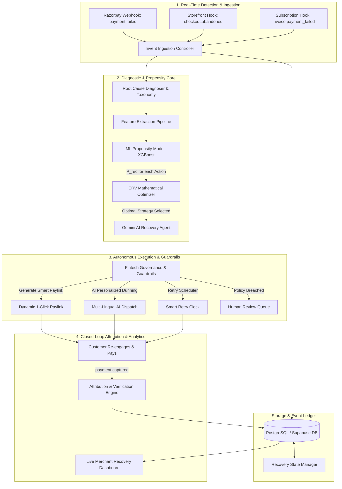

# RecoverAI — Autonomous AI Revenue Recovery Agent for Digital Payments

[](https://www.python.org/)
[](https://fastapi.tiangolo.com/)
[](https://reactjs.org/)
[](https://www.typescriptlang.org/)
[](https://vitejs.dev/)
[](https://ai.google.dev/)
[](https://supabase.com/)
[](LICENSE)

> **RecoverAI** is an enterprise-grade Autonomous AI Revenue Recovery Agent designed for digital commerce, marketplaces, and subscription platforms. It detects payment failures and cart abandonments in real time, diagnoses root causes, scores recovery propensity via Machine Learning, mathematically optimizes Expected Recovery Value (ERV), safely enforces fintech governance guardrails, and executes multi-channel interventions with personalized multi-lingual generative AI.

---

## ⚡ The Core Problem

In digital commerce and digital subscriptions, **failed payments and dropped checkouts account for 15% to 30% of lost gross merchandise value (GMV)**:
- **Payment Decline Friction**: Transient gateway switch timeouts, card limit exhaustion, 3DS OTP verification drops, and expired cards create immediate drop-offs.
- **Dumb Dunning Clocks**: Traditional systems rely on rigid, static email blasts or generic retry intervals that annoy high-value customers and achieve mediocre 10–15% recovery rates.
- **Lack of Decision Intelligence**: Generic retries fail to account for payment rail reliability, failure taxonomy, historical customer LTV, customer friction penalties, or discount economics.
- **Dormant Abandonments**: Incomplete high-intent checkouts drop off without dynamic payment link delivery or preferred alternate rail routing.

---

## 💡 The Solution: Autonomous Closed-Loop Recovery

RecoverAI operates as an autonomous, self-optimizing financial agent across 6 key pillars:



---

## 🚀 Key Features & Capabilities

### 1. Root Cause Diagnosis & Taxonomy
- Automatically categorizes transaction failures into deterministic categories:
  - `TEMPORARY_NETWORK_TIMEOUT` / `BANK_GATEWAY_TIMEOUT`
  - `AUTHENTICATION_FAILED` (3DS OTP drop, biometric timeout)
  - `INSUFFICIENT_FUNDS` / `CARD_LIMIT_EXCEEDED`
  - `CARD_EXPIRED` / `INVALID_INSTRUMENT`
  - `CHECKOUT_ABANDONED` / `FORM_FRICTION`

### 2. ML Recovery Propensity Scoring ($P_{\text{recovery}}$)
- Machine Learning models (trained with **scikit-learn** and **XGBoost**) analyze feature vectors:
  - Customer purchase history, tier (`VIP`, `ENTERPRISE`, `GROWTH`, `STANDARD`), and LTV
  - Gateway latency, error codes, payment rail reliability score
  - Historical recovery affinity per channel
- Evaluates recovery probability $P(\text{Success} \mid \text{Action}_i)$ across candidate recovery strategies:
  - `SMART_PAYLINK_1CLICK`
  - `UPI_SWITCH` / `UPI_INTENT_FALLBACK`
  - `TIMED_SMART_RETRY`
  - `PERSONALIZED_REMINDER`
  - `WHATSAPP_CONCIERGE`
  - `HUMAN_ESCALATION`
  - `NO_ACTION`

### 3. Expected Recovery Value (ERV) Optimization
- Mathematical optimizer computes the net expected revenue recovery:
  $$\text{ERV}_i = P_{\text{recovery}}(i) \times (\text{Amount} - \text{IncentiveCost}(i)) - \text{DeliveryCost}(i) - \text{FrictionPenalty}(i)$$
- Automatically selects the action $\arg\max_i \text{ERV}_i$ subject to merchant policies.

### 4. Generative AI Communications (Google Gemini 3.7 Flash)
- Generates empathetic, contextual recovery messages with localized nuance.
- Multi-lingual localization support: **English (EN)**, **Hindi (HI)**, **Tamil (TA)**, and **Hinglish**.
- Generates transparent operator explanations justifying why a particular strategy was chosen.

### 5. Fintech Guardrails & Policy Governance
- **Frequency Capping**: Maximum touchpoint limits per failed transaction.
- **Cooldown Periods**: Enforces minimum cooldown intervals between repeated interventions.
- **Quiet Hours**: Suppresses customer outreach during configured overnight quiet hours.
- **Discount Ceilings**: Strict thresholds on autonomous recovery incentives.
- **Human-in-the-Loop Queue**: High-risk or high-value transactions (> ₹50,000) automatically escalate for manual review before execution.

### 6. Finite State Machine Recovery Pipeline
- Structured deterministic lifecycle:
  `DETECTED` ➔ `ANALYZED` ➔ `STRATEGY_SELECTED` ➔ `INTERVENTION_SCHEDULED` ➔ `DISPATCHED` ➔ `EXECUTED` ➔ `RECOVERED` / `FAILED`
- Idempotency enforcement via unique cryptographic hashes (`idempotency_key = hash(order_id + event_type + attempt)`).

### 7. Real-Time Telemetry & Server-Sent Events (SSE)
- Live streaming event bus (`/events/stream`) pushes incoming payment failures, agent state transitions, guardrail interventions, and settled recoveries directly to connected client dashboards.

### 8. Role-Based Access Control (RBAC) & Live Database
- Integrated with **Supabase PostgreSQL** and authoritative `profiles` schema with Row Level Security (RLS) policies.
- Role management separating `admin` and `operator` capabilities.

---

## 🖥️ Merchant Dashboard Modules

The React + Vite frontend provides an interactive, dark-mode glassmorphic control center:

| Dashboard Page | Purpose |
| :--- | :--- |
| **Overview** | High-level executive KPIs (Revenue at Risk, Recovered GMV, Recovery Rate %, Active Recoveries, Real-time Ticker). |
| **At-Risk Revenue** | Live triage queue of failing transactions filtered by urgency, high-value status, and bank outages. |
| **Recovery Agent** | Step-by-step state machine runner, live diagnosis inspector, ERV comparator, and AI message preview. |
| **Demo Store & Checkout** | End-to-end sandbox simulator allowing users to trigger live card, UPI, NetBanking failures, paylinks, and instant recoveries. |
| **Analytics** | Recovery rate trends, strategy performance matrix, payment rail breakdown, and failure root cause distribution. |
| **Cart Abandonment** | Real-time tracking of abandoned checkout funnels with 1-click cart recovery dispatch. |
| **Fintech Guardrails** | Central governance control to configure quiet hours, discount caps, cooldown rules, and manage the Human Approval Queue. |
| **Simulation Sandbox** | Batch Monte Carlo simulator to test recovery strategies against synthetic or historical data. |
| **Audit Trail** | Immutable, cryptographically verifiable compliance log tracking every autonomous agent action and outcome. |
| **User & RBAC Management** | User administration portal to assign roles, invite teammates, and monitor operator sessions. |

---

## 🛠️ Technology Stack

```text
RecoverAI Stack
├── Frontend:     React 18, TypeScript, Vite, TailwindCSS / Custom Glassmorphic Tokens, Lucide Icons
├── Backend:      Python 3.11+, FastAPI, Pydantic v2, SQLAlchemy 2.0, Uvicorn, SSE-Starlette
├── Database:     PostgreSQL (Supabase Live Instance) / SQLite Local Fallback
├── AI / LLM:     Google GenAI SDK (Gemini 2.5 Flash), Multi-Lingual Prompt Engine
├── ML Engine:    scikit-learn, XGBoost, pandas, NumPy (Propensity & ERV optimization)
├── Gateway:      Razorpay Test Mode SDK (Orders, Verification, Dynamic Payment Links, Webhooks)
└── Testing:      Pytest, TestClient, E2E Verification Suites, Failure Injection Matrix
```

---

## 📁 Repository Structure

```text
RecoverAI/
├── backend/
│   ├── app/
│   │   ├── api/v1/endpoints/   # Modular API routes (analytics, checkout, guardrails, payments, etc.)
│   │   ├── core/               # App configuration, auth, RBAC, structured logging
│   │   ├── database/           # SQLAlchemy session, base, migrations, and seed scripts
│   │   ├── ml/                 # Machine learning feature extractors and propensity scoring
│   │   ├── models/             # SQLAlchemy ORM database models
│   │   ├── schemas/            # Pydantic validation request/response schemas
│   │   └── services/           # Decision engine, recovery executor, Razorpay client, Gemini agent
│   ├── tests/                  # Pytest test suites (unit, integration, state machine, RBAC, e2e)
│   ├── migrate_live.py         # Live database migration script for Supabase
│   ├── requirements.txt        # Python backend dependencies
│   └── .env                    # Backend environment variables (local)
├── frontend/
│   ├── src/
│   │   ├── components/         # Layout (Sidebar, Topbar), charts, modals, UI elements
│   │   ├── pages/              # Overview, RecoveryAgent, DemoCheckout, Guardrails, Analytics, etc.
│   │   ├── services/           # API client service layer and Supabase client
│   │   ├── types/              # TypeScript interfaces and schema types
│   │   └── data/               # Local mock fallback dataset
│   ├── package.json            # Frontend scripts and npm dependencies
│   ├── vite.config.ts          # Vite configuration with API reverse proxy
│   └── .env                    # Frontend environment configuration
├── docs/                       # System architecture specs and state machine documentation
├── data/                       # Synthetic dataset seeds and test telemetry
└── README.md                   # Project documentation
```

---

## 🚀 Quickstart & Setup Guide

### 1. Prerequisites
- **Python 3.11+**
- **Node.js 18+** & **npm**
- (Optional) **Supabase** account for hosted PostgreSQL / Auth
- (Optional) **Razorpay** test account credentials
- (Optional) **Google Gemini API Key**

---

### 2. Backend Setup

1. **Navigate to the backend folder**:
   ```bash
   cd backend
   ```

2. **Create and activate a virtual environment**:
   ```bash
   # Windows (PowerShell)
   python -m venv .venv
   .venv\Scripts\Activate.ps1

   # Linux / macOS
   python3 -m venv .venv
   source .venv/bin/activate
   ```

3. **Install Python dependencies**:
   ```bash
   pip install -r requirements.txt
   ```

4. **Configure environment variables**:
   Create or edit `backend/.env`:
   ```ini
   PROJECT_NAME="RecoverAI API"
   VERSION="1.0.0"
   API_V1_STR="/api"
   ENVIRONMENT="development"
   DEBUG=True

   # CORS
   CORS_ORIGINS=["http://localhost:3000","http://localhost:5173","http://127.0.0.1:3000","http://127.0.0.1:5173"]

   # Database (Supabase Live PostgreSQL or local SQLite fallback)
   DATABASE_URL=postgresql://postgres.<project-ref>:<password>@<host>:5432/postgres
   SQLITE_FALLBACK_URL=sqlite:///./recoverai.db

   # Supabase Credentials
   SUPABASE_URL=https://<project-ref>.supabase.co
   SUPABASE_PUBLISHABLE_KEY=sb_publishable_...
   SUPABASE_SERVICE_ROLE_KEY=sb_secret_...
   SUPABASE_JWKS_URL=https://<project-ref>.supabase.co/auth/v1/.well-known/jwks.json

   # Payment Gateway (Razorpay Test Mode Only)
   RAZORPAY_KEY_ID=rzp_test_...
   RAZORPAY_KEY_SECRET=...
   RAZORPAY_WEBHOOK_SECRET=...
   WORKSPACE_ENCRYPTION_KEY=... # 32-byte base64 AES-256-GCM key for encrypted merchant credentials

   # Google Gemini AI SDK
   GEMINI_API_KEY=...
   GEMINI_MODEL=gemini-2.5-flash
   ```

5. **Run database migrations**:
   ```bash
   alembic upgrade head
   ```

6. **Start the FastAPI server**:
   ```bash
   python -m uvicorn app.main:app --host 0.0.0.0 --port 8000 --reload
   ```
   - API Server: `http://localhost:8000`
   - Interactive Swagger Docs: `http://localhost:8000/docs`
   - Health Check: `http://localhost:8000/health`

7. **Start the Standalone Background Worker Process**:
   ```bash
   python -m app.worker
   ```
   Runs the autonomous recovery queue, retry clocks, and webhook escalation handlers independently of browser or web server lifecycles.

---

### 3. Frontend Setup

1. **Navigate to the frontend folder**:
   ```bash
   cd ../frontend
   ```

2. **Install Node dependencies**:
   ```bash
   npm install
   ```

3. **Configure environment variables**:
   Create or edit `frontend/.env`:
   ```ini
   VITE_API_BASE_URL=http://localhost:8000
   VITE_SUPABASE_URL=https://<project-ref>.supabase.co
   VITE_SUPABASE_PUBLISHABLE_KEY=sb_publishable_...
   VITE_RAZORPAY_KEY_ID=rzp_test_...
   ```

4. **Start the Vite development server**:
   ```bash
   npm run dev
   ```
   - Access the Merchant Dashboard: `http://localhost:3000`

---

## 🧪 Testing & Verification

RecoverAI includes a comprehensive test suite covering unit tests, state machine transitions, API endpoints, multi-tenant isolation, RBAC enforcement, failure injection, and SaaS security:

```bash
# Run all backend tests
cd backend
python -m pytest -v

# Run multi-tenant SaaS security suite
python -m pytest tests/test_saas_security_suite.py -v

# Run tenant isolation & cross-workspace tests
python -m pytest tests/test_phase4_tenant_isolation.py -v

# Run fintech guardrails & governance tests
python -m pytest tests/test_guardrails.py -v

# Run RBAC security and role tests
python -m pytest tests/test_rbac.py -v

# Run webhook ingestion & HMAC signature tests
python -m pytest tests/test_webhooks.py -v
```

---

## 📡 SaaS Multi-Merchant Architecture & Webhooks

| Method | Endpoint | Description |
| :--- | :--- | :--- |
| `GET` | `/health` | Service health status and live database connectivity. |
| `GET` | `/api/v1/workspaces/current` | Active workspace details and merchant tier settings. |
| `POST` | `/api/v1/workspaces` | Creates an isolated merchant workspace (caller assigned as Admin). |
| `POST` | `/api/v1/workspaces/integrations/razorpay` | Connects merchant Razorpay Test credentials (AES-256 encrypted; `rzp_test_...` strictly required). |
| `POST` | `/api/v1/webhooks/razorpay/{endpoint_id}` | Dedicated per-merchant webhook endpoint with HMAC verification and workspace isolation. |
| `GET` | `/api/v1/events/ticket` | Generates short-lived, single-use cryptographic SSE ticket. |
| `GET` | `/api/v1/events/stream` | Multi-tenant Server-Sent Events (SSE) live bus scoped by `workspace_id`. |
| `GET` | `/api/v1/guardrails/policies` | Per-workspace fintech governance rules and thresholds. |
| `POST` | `/api/v1/guardrails/policies` | Updates workspace guardrails (requires `ADMIN` role). |
| `POST` | `/api/checkout/check-abandoned` | Autonomous checkout abandonment detector and recovery launcher. |

---

## 🔒 Security & Compliance

- **Strict Razorpay Test Mode Only**: Real-money processing is strictly forbidden. Live API keys (`rzp_live_...`) are rejected with `400 Bad Request`.
- **Tenant Isolation**: Every database query, SSE broadcast, audit record, and recovery action is strictly partitioned by `workspace_id`. Zero-membership users receive `403 Forbidden` (`NO_WORKSPACE_MEMBERSHIP`).
- **AES-256-GCM Vault**: Merchant secrets and webhook tokens are encrypted at rest using AES-256-GCM with PBKDF2 key derivation.
- **Cryptographic Webhook Ingestion**: Per-merchant HMAC-SHA256 signatures are validated before payload processing.
- **Single-Use Stream Tickets**: SSE stream connections require short-lived, single-use signed cryptographic tickets, mitigating URL token leakage.
- **Durable Background Processing**: Independent worker architecture ensures background jobs continue uninterrupted across client disconnects.

---

## 📄 License

This project is licensed under the [MIT License](LICENSE).

