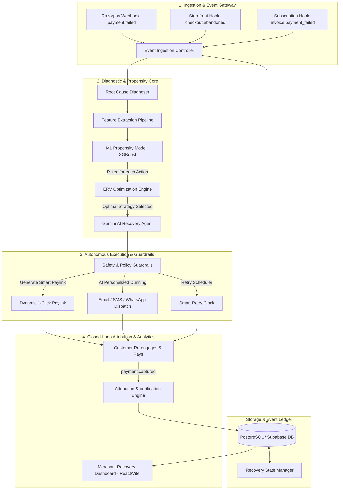

# RecoverAI — System Architecture Specification

## 1. Executive Overview

**RecoverAI** is an Autonomous AI Revenue Recovery Agent engineered to recover lost digital commerce and subscription revenue. The platform operates on a closed-loop autonomous cycle: detecting payment failure and abandonment signals, categorizing root causes, scoring recovery probability across candidate channels, calculating Expected Recovery Value (ERV), generating personalized recovery artifacts via LLM, executing targeted interventions, and recording verifiable revenue recovery.

---

## 2. End-to-End System Architecture

---

## 3. Autonomous Recovery Lifecycle

The recovery loop executes within milliseconds to minutes of failure detection through 6 autonomous stages:

### Stage 1: Detection & Ingestion
- **Event Types**: `payment.failed`, `checkout.abandoned`, `order.pending_expired`, `dunning.invoice_failed`.
- **Payload Capture**: Transaction metadata (amount, currency, merchant ID, customer ID), payment instrument info (method: UPI/Card/NetBanking, issuer bank, card brand), error details (decline code, error reason, latency, step dropped).

### Stage 2: Root Cause Diagnosis & Risk Categorization
- Classifies failures into deterministic risk categories:
  1. **Transient Network / Gateway Friction**: Timeout, bank server 500, OTP delay.
  2. **Insufficient Balance / Spending Limit**: Card limit exceeded, low balance.
  3. **Authentication & 3DS Failure**: OTP mistyped, biometric timeout, 3DS modal dismiss.
  4. **Friction / Abandonment**: Cart abandoned at price review, form abandonment, preferred payment method missing.
  5. **Card Invalidation / Expiry**: Card expired, card blocked, international transaction disabled.

### Stage 3: ML Recovery Propensity Scoring ($P_{\text{recovery}}$)
- Machine learning propensity model (Trained with XGBoost & scikit-learn) evaluates feature vectors:
  - Customer purchase history & LTV
  - Error code category & retry count
  - Payment method reliability score
  - Time of day, day of week, device category
- Outputs probability score $P(\text{Success} \mid \text{Action}_i)$ for candidate intervention actions $i \in \{ \text{Instant 1-Click Link}, \text{Switch to UPI}, \text{Timed Smart Retry}, \text{Incentivized Dunning Email}, \text{WhatsApp Agent} \}$.

### Stage 4: Expected Recovery Value (ERV) Optimization
- Calculates Expected Recovery Value for every feasible strategy:
  $$\text{ERV}_i = P_{\text{recovery}}(i) \times (\text{Amount} - \text{IncentiveCost}(i)) - \text{DeliveryCost}(i)$$
- Selects $\arg\max_i \text{ERV}_i$ subject to merchant guardrail policies (e.g., maximum allowable discount, quiet hours, cooldown period between touches).

### Stage 5: Safe Intervention Execution
- Generates contextualized recovery communications via **Google Gemini 2.5 Flash** (adapting tone based on customer profile, urgency, and specific error reason).
- Dispatches dynamic, pre-authenticated checkout links supporting alternative payment methods (e.g. UPI Intent fallback for failed cards).
- Configures automated retries timed for when customer accounts are most likely to have available funds (e.g. salary cycles or off-peak bank maintenance windows).

### Stage 6: Attribution, Ledger & Real-Time Analytics
- Captures settlement confirmation via webhooks.
- Computes exact recovered revenue, ROI, and recovery cycle duration.
- Updates continuous metrics on the merchant dashboard.

---

## 4. Component Specification

### 4.1 Frontend (`/frontend`)
- **Stack**: React 18, TypeScript, Vite.
- **Design System**: Modern dark-mode glassmorphic interface built with custom vanilla CSS tokens and Lucide React icons.
- **Key Modules**:
  - **Live Recovery Stream**: Real-time ticker of incoming failures, autonomous agent decisions, and successful recoveries.
  - **ERV Optimizer Inspector**: Transparent visualization of ML scores, cost-benefit trade-offs, and selected strategies.
  - **Simulated Checkout & Recovery Sandbox**: Interactive customer-facing payment simulator to trigger and observe real-time recovery.
  - **Merchant Policy Controls**: Threshold configuration for automated discounts, frequency caps, and channel approvals.

### 4.2 Backend Orchestrator (`/backend`)
- **Stack**: Python 3.11, FastAPI, Pydantic v2, Uvicorn.
- **Key Modules**:
  - `routers/webhooks.py`: Ingestion endpoints for payment gateway and checkout hooks.
  - `routers/recovery.py`: Recovery execution and manual intervention override endpoints.
  - `services/engine.py`: Orchestrates state transitions, ML scoring, and agent prompting.
  - `services/guardrails.py`: Enforces idempotency, rate limiting, and merchant rules.
  - `services/razorpay_client.py`: Sandbox integration with Razorpay test mode APIs.

### 4.3 ML & Intelligence Core (`/ml`)
- **Stack**: pandas, scikit-learn, XGBoost.
- **Key Modules**:
  - `propensity_model.py`: Trained classifier predicting recovery probabilities per intervention.
  - `erv_calculator.py`: Mathematical optimizer for expected net recovery.
  - `feature_pipeline.py`: Real-time feature extractor transforming raw gateway payloads into model tensors.

### 4.4 Generative AI Agent (`Google GenAI SDK`)
- **Model**: `gemini-2.5-flash`
- **Responsibilities**: Generates personalized, empathetic recovery messages with precise technical instructions (e.g., how to approve UPI mandates, enabling international card usage, or redeeming instant recovery credits).

### 4.5 Data & State Layer (`PostgreSQL / Supabase`)
- **Tables**:
  - `merchants`: Merchant config, guardrails, and API keys.
  - `payment_events`: Raw transaction failure and checkout drop logs.
  - `recovery_cases`: Active and historical recovery cases with state tracking.
  - `recovery_interventions`: Dispatched interventions, calculated ERV, and channel metadata.
  - `revenue_ledger`: Verifiable ledger of recovered amounts, fees, and attribution tags.

---

## 5. Security, Guardrails & Idempotency

1. **Idempotency**: All webhook events and intervention dispatches require unique idempotency keys (`idempotency_key = hash(order_id + event_type + attempt)`) to avoid duplicate dunning or charges.
2. **Frequency Capping**: Hard ceiling of max 3 touchpoints per failed transaction with minimum cooldown windows.
3. **Secret Isolation**: Secrets managed via environment variables with zero plaintext logging or client exposure.
4. **Human-in-the-Loop Override**: High-value transactions (e.g. > $1,000) can optionally trigger approval flags before autonomous dispatch.
